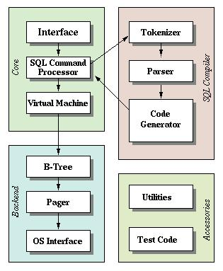

## 1. 关系型数据库
关系型数据库：以表格形式存储，表与表之间通过外键建立联系。
- 结构化：以表格形式组织数据，便于管理和查询。
- 支持 SQL：使用结构化查询语言（SQL）进行数据操作。
- 事务支持：支持 ACID（原子性、一致性、隔离性、持久性）

## 2. 常见的关系型数据库：
- SQLite
- MySQL
- PostgreSQL
- Oracle Database

## 3. SQLite 体系结构
### 3.1 组件概览
- **主要组件**：内核、SQL编译器、后端、附件
    
- **虚拟机与VDBE**：所有SQL语句都被编译为可在SQLite虚拟机（VDBE）执行的指令，便于调试和扩展
- **存储方式**：支持最大2TB数据库，全部数据存储在单一磁盘文件，可跨平台移动
- **数据结构**：数据以B+树结构存储在磁盘上
- **权限管理**：数据库权限由操作系统文件系统控制

### 3.2 体系结构图
> 流水线：在体系结构栈的顶部编译查询语句，在中部执行它，在底部处理操作系统的存储和接口
- 前端解析系统 + 后端引擎
  - 前端可分为三个模块：<1> 标示分析；<2>语法分析；<3> 代码生成器。
  - 后端：<1>虚拟机(VM)；<2> B/B+树；<3> 页面调度程序(pager)；<4>操作系统交界面

### 3.3 主要模块说明
1. **公共接口（Interface）**  
   - 大部分公共接口由main.c, legacy.c和vdbeapi.c源文件中的函数来实现

2. **词法分析器（Tokenizer）**  
   - 将SQL字符串分割为标识符（token）传递给解析器，实现于 tokenize.c

3. **语法分析器（Parser）**  
   - 赋予token具体含义，使用Lemon生成，定义于 parse.y

4. **代码生成器（Code Generator）**  
   - 生成虚拟机指令，涉及 attach.c, auth.c, build.c, delete.c, expr.c, insert.c, pragma.c, select.c, trigger.c, update.c, vacuum.c, where.c

5. **虚拟机（Virtual Machine）**  
   - 执行代码生成器生成的指令（有一个存储中间数据的存储栈，每条指令包含一个操作码和不超过三个额外的操作数）

6. **B-树（B-Tree）**  
   - 数据以B-树形式存储，每个表和索引对应一棵B-树，格式细节被记录在 btree.c 开头的备注里

7. **页面高速缓存（Page Cache）**  
   - 负责读、写和缓存B-树数据块，支持回滚和原子提交，实现在 pager.c

8. **操作系统接口（OS Interface）**  
   - 提供跨平台支持，接口定义于 os.h，具体实现如 os_unix.c, os_win.c

9. **实用工具（Utilities）**  
   - 包括内存分配、字符串处理、哈希表、Unicode转换、printf扩展、随机数生成等

10. **测试代码（Test Code）**  
    - 包含大量测试和断言，专用测试文件如 test1.c~test5.c, md5.c, os_test.c

## 4. 模块结构
1. **接口（Interface）**  
   - 由 SQLite C API 构成，应用程序通过 API 与数据库交互。

2. **编译器（Compiler）**  
   - 包括分词器（Tokenizer）、语法分析器（Parser）和代码生成器（Code Generator）。
   - 分词器和分析器对 SQL 语句进行语法检查，生成语法树。
   - 代码生成器将语法树转换为 VDBE 虚拟机可执行的操作码。

3. **后端（Backend）**  
   - 包括 B-树（B-tree）、页缓存管理（Pager）和操作系统接口（OS Interface）。
   - B-tree 用于数据索引和页面关系维护，便于快速查找数据。
   - Pager 管理页面的读写、缓存和事务，负责数据的持久化和一致性。
   - OS 接口实现跨平台的数据文件读写。
