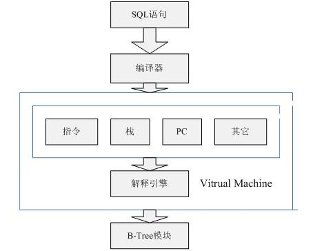

## 1. VDBE（虚拟数据库引擎）
VDBE（Virtual Database Engine）负责将 SQL 语句编译为一系列低级指令在 SQLite 的虚拟机上执行
- **指令集**：VDBE 使用一种简单的指令集，每条指令包含一个操作码和不超过三个操作数。
- **存储栈**：VDBE 维护一个存储中间结果的栈，操作数可以是栈中的值，也可以是数据库中的值。
- **跨平台**：VDBE有自己完善的硬体架构，如处理器、堆栈、寄存器、指令系统

## 2. B 树模块
B 树模块负责在 SQLite 中存储和检索数据
- **B 树结构**：数据以 B 树形式存储，每个表和索引对应一棵 B 树。
- **页面**：B 树的每个节点称为页面，页面大小通常为 1024 字节。
- **操作**：B 树模块提供插入、删除、查找等操作，支持事务和并发访问。
- **事务支持**：B 树模块支持事务的原子性和一致性，确保数据在事务提交前不会被其他事务看到。

